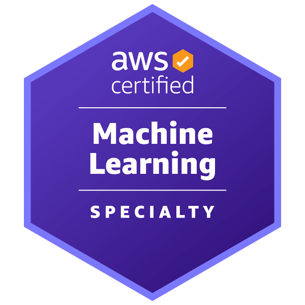
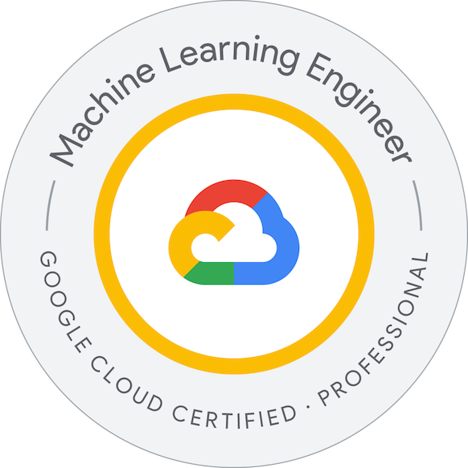
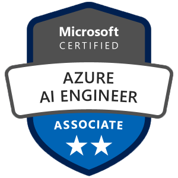

# 👋 Hi, I'm Alberto Valdés

I'm a Machine Learning & AI Engineer with over 4 years of experience designing, deploying, and leading end-to-end AI solutions across sectors like consulting, banking, insurance, and investment.

My work focuses on building robust and scalable ML/AI systems using cloud platforms such as **AWS**, **GCP**, **Azure**, and **Databricks**. I specialize in both **Data Pipelines** and **ML Pipelines**, working with structured and unstructured data (text, images, video, audio) in batch and streaming environments.

Some of the areas I work in include:

- **Machine Learning**
- **Deep Learning**
- **Computer Vision**
- **Transformers & LLMs** (Fine-tuning, RAG, LangChain, Hugging Face)
- **Chatbots**
- **OCR**, **NER** 
- **Time Series and Statistical Modeling**

With a strong academic foundation in **Applied Mathematics**, **Optimization**, and **Statistics**, I’m passionate about solving complex problems through AI and delivering real-world impact with clean, well-documented code.

## 🌩️ Cloud Certifications

  
  
  

I hold professional certifications from all three major cloud providers:

- 🟨 AWS Certified Machine Learning – Specialty
- 🟥 Google Cloud Professional Machine Learning Engineer    
- 🟦 Microsoft Azure AI Engineer Associate  

## Repositories

**🧠 ML/AI Lab:** This is the space where I upload differents reviews of AI and ML Contents plus code!  

🔗 (https://github.com/anvaldes/AI_ML_Lab)

## 📩 Contact

💡 Feel free to explore my repositories to see some of the projects I’ve worked on — and don’t hesitate to reach out!

📫 alberto.valdes.gonzalez.96@gmail.com   \\
🔗 [Linkr](https://linkr.bio/beto_valdes_g) \\
💼 [Linkedin](https://www.linkedin.com/in/alberto-andres-valdes-gonzalez) \\
