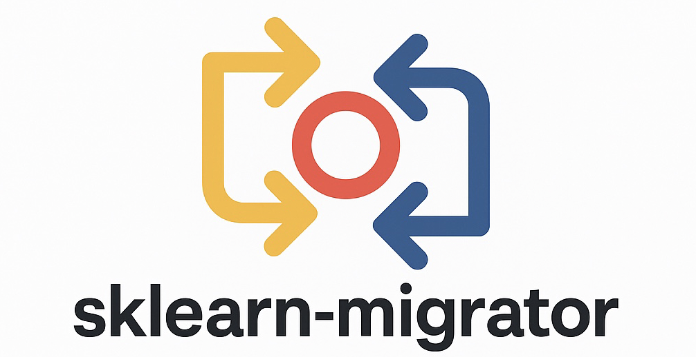
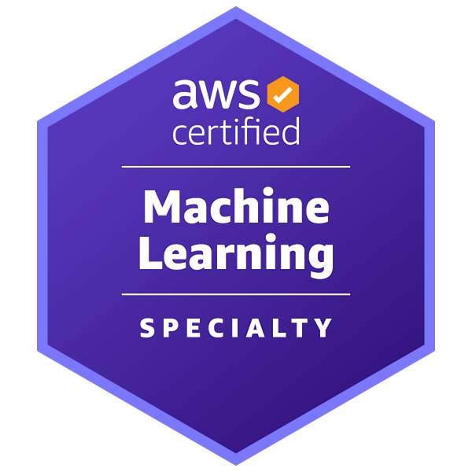
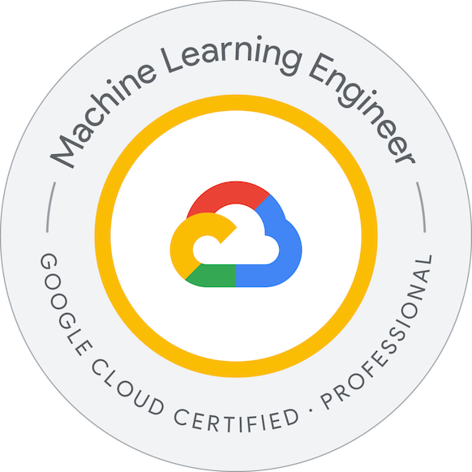

# 👋 Hi, I'm Alberto Valdés

I'm a ML/AI Engineer and MLOps with over 4 years of experience designing, deploying, and leading end-to-end AI solutions across sectors like consulting, banking, insurance, and investment.

My work focuses on building robust and scalable ML/AI systems using cloud platforms such as **AWS**, **GCP**, **Azure**, and **Databricks**. I specialize in both **Data Pipelines** and **ML Pipelines**, working with structured and unstructured data (text, images, video, audio) in batch and streaming environments.

Some of the areas I work in include:

- **Machine Learning**
- **Deep Learning**
- **Computer Vision**
- **Transformers & LLMs** (Fine-tuning, RAG, LangChain, Hugging Face)
- **Chatbots**
- **OCR**, **NER** 
- **Time Series and Statistical Modeling**

With a strong academic foundation in **Applied Mathematics**, **Optimization**, and **Statistics**, I’m passionate about solving complex problems through AI and delivering real-world impact with clean, well-documented code.

## 📦 sklearn-migrator

I'm also the creator of [`sklearn-migrator`](https://github.com/anvaldes/sklearn-migrator), a Python library designed to serialize and migrate `scikit-learn` models across incompatible versions — helping teams manage long-term model compatibility and portability in production environments.

  

## 🌩️ Cloud Certifications

  
  
  

I hold professional certifications from all three major cloud providers:

- 🟨 [AWS Certified Machine Learning – Specialty](https://www.credly.com/badges/1e3275e2-d697-4990-86c6-747d9381afbd/public_url)
- 🟥 [Google Cloud Professional Machine Learning Engineer](https://www.credly.com/badges/3db1493e-cd2a-4af9-ae30-94cced9c5922/public_url)
- 🟦 [Microsoft Azure AI Engineer Associate](https://learn.microsoft.com/api/credentials/share/es-mx/AlbertoAndrsValdsGonzlez-3252/A7E0820F404909B7?sharingId=155C173A91C1B5E3)

## Repositories

**🧠 ML/AI Lab:** This is the space where I upload differents reviews of AI and ML Contents plus code!  

🔗 (https://github.com/anvaldes/AI_ML_Lab)

**🟨 Data & ML Projects on AWS:**
- 📁 [Proyecto 1 - Data Pipeline (AWS)](https://github.com/anvaldes/proyecto_1_data_aws)
- 🤖 [Proyecto 1 - ML Pipeline [Hyperparameter Tuning, Built in] (AWS)](https://github.com/anvaldes/proyecto_1_ml_aws_hpt_built_in)
- 🤖 [Proyecto 1 - ML Pipeline [Hyperparameter Tuning, Custom] (AWS)](https://github.com/anvaldes/proyecto_1_ml_aws_hpt_custom)
- 🤖 [Proyecto 1 - ML Pipeline [Built in] (AWS)](https://github.com/anvaldes/proyecto_1_ml_aws_pipeline_built_in)
- 🤖 [Proyecto 1 - ML Pipeline [Custom] (AWS)](https://github.com/anvaldes/proyecto_1_ml_aws_pipeline_custom)
- 📁 [Proyecto 2 - Data Pipeline (AWS)](https://github.com/anvaldes/proyecto_2_data_aws)
- 📁 [Proyecto 2 - Data Pipeline [Terraform] (AWS)](https://github.com/anvaldes/proyecto_2_data_aws_terraform)
- 🤖 [Proyecto 2 - ML Pipeline (AWS)](https://github.com/anvaldes/proyecto_2_ml_aws)
- ⚙️ [Proyecto 2 - ML Pipeline GPU (AWS)](https://github.com/anvaldes/proyecto_2_ml_aws_gpu)

**🟥 Data & ML Projects on GCP:**
- 📁 [Proyecto 1 - Data Pipeline (GCP)](https://github.com/anvaldes/proyecto_1_data_gcp)
- 🤖 [Proyecto 1 - ML Pipeline (GCP)](https://github.com/anvaldes/proyecto_1_ml_gcp)
- 📁 [Proyecto 2 - Data Pipeline (GCP)](https://github.com/anvaldes/proyecto_2_data_gcp)
- 🤖 [Proyecto 2 - ML Pipeline (GCP)](https://github.com/anvaldes/proyecto_2_ml_gcp)
- ⚙️ [Proyecto 2 - ML Pipeline GPU (GCP)](https://github.com/anvaldes/proyecto_2_ml_gcp_gpu)

**🟦 Data & ML Projects on Azure:**
- 📁 [Proyecto 1 - Data Pipeline (Azure)](https://github.com/anvaldes/proyecto_1_data_azure)
- 🤖 [Proyecto 1 - ML Pipeline [Hyperparameter Tuning] (Azure)](https://github.com/anvaldes/proyecto_1_ml_azure_hpt)
- 🤖 [Proyecto 1 - ML Pipeline (Azure)](https://github.com/anvaldes/proyecto_1_ml_azure_pipeline)
- 📁 [Proyecto 2 - Data Pipeline (Azure)](https://github.com/anvaldes/proyecto_2_data_azure)
- 🤖 [Proyecto 2 - ML Pipeline (Azure)](https://github.com/anvaldes/proyecto_2_ml_azure)
- ⚙️ [Proyecto 2 - ML Pipeline [GPU] (Azure)](https://github.com/anvaldes/proyecto_2_ml_azure_gpu)

**🤖 AI Engineer Projects:**
- 🔍 [Chatbot RAG - Dev](https://github.com/anvaldes/chatbot_RAG_dev)
- 🔍 [Chatbot RAG - Prod Local](https://github.com/anvaldes/chatbot_RAG_prod_local)
- 📡 [AI Agent 1](https://github.com/anvaldes/ai_agent_1)
- 📡 [AI Agent 2](https://github.com/anvaldes/ai_agent_2)
- 🦜 [Gemini, Langraph, Chainlit, CloudRun](https://github.com/anvaldes/cloudrun_chainlit_lg)

## 📩 Contact

💡 Feel free to explore my repositories to see some of the projects I’ve worked on — and don’t hesitate to reach out!

📫 alberto.valdes.gonzalez.96@gmail.com

🔗 [Linktree](https://linktr.ee/beto_valdes_g)

💼 [Linkedin](https://www.linkedin.com/in/alberto-andres-valdes-gonzalez)
